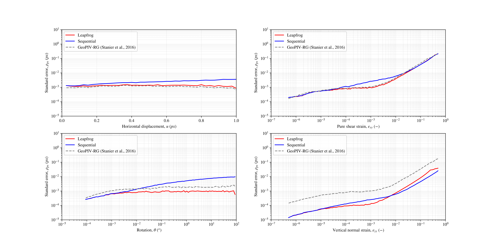

07 — Validation: comparing results against known deformations
==============================================================

``Validation`` quantifies how accurately ``geopyv_dev`` recovers the deformation that
was applied when generating a synthetic speckle sequence. It compares the *observed*
warp paths from one or more solved ``Field`` objects against the *applied* ground-truth
warps encoded in the ``Speckle`` object that generated the images.

When you have synthetic images generated by ``gp.Speckle``, you know exactly what
deformation was applied at every pixel and every frame. ``Validation`` exploits this
by evaluating the ground-truth warp at every particle's initial position for each
frame (the *applied* field), extracting the warp accumulated by the same particles
during the DIC solve (the *observed* field), and computing the error between them —
revealing the accuracy and spatial distribution of any residual. This is the standard
way to benchmark DIC algorithms against synthetic experiments before applying them to
real images.

Setup
------

``Validation`` requires the ``Speckle`` that generated the images and one or more
**solved** ``Field`` objects:

.. code-block:: python

   import geopyv_dev as gp

   speckle  = gp.load("data/speckle.pyv")    # must match the field's sequence
   field    = gp.load("data/field.pyv")

   val = gp.Validation(
       speckle         = speckle,
       field_solutions = [field],
       labels          = ["standard"],
   )

``labels`` is a list of strings of the same length as ``field_solutions``, used
to identify each field in plots and solution accessors.  Pass multiple fields
to compare different solve configurations side-by-side.

Solving
--------

.. code-block:: python

   solution = val.solve(
       cumulative = True,    # True = cumulative warp; False = frame-to-frame increment
       skim       = None,    # optional: remove the N worst-error particles per frame
   )

``cumulative=True`` (default) compares the total accumulated warp from frame 0 to
each frame.  ``cumulative=False`` compares the per-increment warp step, which is
useful for sequential (leapfrog) analyses.

``skim`` removes a fixed number of outlier particles from every frame — ranked by
displacement error — before computing statistics.  Use it sparingly: it is better
to investigate why particles fail than to silently discard them.

Results
--------

``solution`` is a ``ValidationSolution`` with the following attributes:

.. list-table::
   :header-rows: 1

   * - Attribute
     - Shape
     - Description
   * - ``solution.pm``
     - ``(image_no, 12)``
     - Ground-truth deformation parameters at each image
   * - ``solution.mult``
     - ``(image_no,)``
     - Progression multiplier at each image (deformation scale)
   * - ``solution.fields``
     - list of ``ValidationFieldData``
     - Per-field results; one entry per element of ``field_solutions``
   * - ``solution.labels``
     - list of str
     - Labels passed at construction

Each ``ValidationFieldData`` exposes:

.. list-table::
   :header-rows: 1

   * - Attribute
     - Shape
     - Description
   * - ``.applied``
     - ``(n_frames, n_particles, 12)``
     - Ground-truth warp at each particle and frame
   * - ``.observed``
     - ``(n_frames, n_particles, 12)``
     - DIC-recovered warp at each particle and frame
   * - ``.coordinates``
     - ``(n_frames+1, n_particles, 2)``
     - Particle coordinates at each frame

``geopyv_dev.plots`` includes several validation-specific plot functions: the
standard deviation of error over time (``component`` indexes into the 12-element
warp vector: 0 = u, 1 = v, 2..5 = strain gradient terms (order-1), 6..11 =
second-order terms), and the spatial distribution of error at a given frame
(``quantity="R"`` shows the displacement residual magnitude; ``quantity="u"`` or
``"v"`` shows the signed component error).

.. code-block:: python

   import geopyv_dev.plots as gpp

   fd = solution.fields[0]
   print(fd.applied.shape)    # (n_frames, n_particles, 12)
   print(fd.observed.shape)

   # u-displacement error at frame 0, all particles
   u_error = fd.applied[0, :, 0] - fd.observed[0, :, 0]
   print(f"mean |u error| frame 0: {abs(u_error).mean():.4f} px")

   # Standard deviation of u-displacement error vs frame number
   gpp.standard_error_validation(solution, component=0)

   # Spatial distribution of error at frame 2, u-component
   gpp.spatial_error_validation(solution, field_index=0, time_index=2, quantity="R")

Validation against geoPIV-RG
-------------------------------

The figure below shows ``geopyv_dev`` validated against
`geoPIV-RG <https://doi.org/10.1680/jgele.19.00004>`_, a widely-used reference DIC
implementation for geotechnics. A synthetic shear-band sequence (25 px amplitude,
standard progression) was analysed with both packages; the standard error in the
u-displacement is plotted against the deformation multiplier.

The results show that ``geopyv_dev`` matches geoPIV-RG to within sub-pixel accuracy
across the full deformation range, with the Rust-based solver achieving equivalent
precision at substantially higher throughput.

**Next:** :doc:`08_calibration` — converting pixel measurements to physical units
with ``Calibration``.
